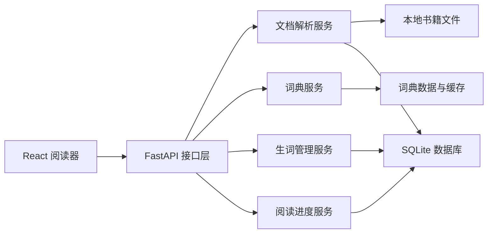

# ReadMaster 技术设计方案

> 状态：已确认，进入实施  
> 目标版本：MVP v0.1  
> 设计原则：先完成最小阅读学习闭环，再逐步增加训练与 AI 能力。

## 0. 已确认方案

- A1：本地 Web 应用
- B4：混合词典架构，v0.1 以本地基础词典为主
- C1：英文阅读与单词中文释义
- D1：删除书籍后保留生词和上下文快照
- E1：桌面浏览器优先，手机保证基本可用

## 1. 建设目标

第一版聚焦以下完整流程：

1. 用户导入一个英文 TXT 文件。
2. 系统解析书籍、章节和段落。
3. 用户在阅读器中阅读英文内容。
4. 用户点击不认识的单词，查看基础词汇信息和当前语境。
5. 用户将单词加入生词库。
6. 系统记录单词来源、出现位置、遇见次数和熟悉度。
7. 用户下次进入时可以恢复阅读进度。

第一版暂不包含：

- PDF、EPUB 和 Markdown 导入
- 用户注册、登录及多用户协作
- AI 长难句分析
- 自动生成训练题
- 复杂复习算法
- 向量数据库和知识图谱
- 云端部署与跨设备同步

## 2. 总体架构

ReadMaster 第一版采用前后端分离的单体架构，以降低开发和部署复杂度。



系统默认在本机运行：

- 浏览器负责阅读界面和交互。
- Python 服务负责解析、查询和业务规则。
- SQLite 保存结构化数据。
- 导入的原始文件保存在项目运行数据目录，不直接写入代码仓库。

## 3. 技术栈

### 3.1 前端

- React
- TypeScript
- Vite
- React Router
- 原生 CSS 变量与组件样式
- Vitest + React Testing Library

暂不引入大型 UI 框架。阅读器需要较强的排版控制，使用轻量样式体系更容易控制行宽、字号、行距、主题和双语布局。

### 3.2 后端

- Python 3.12 或更高版本
- FastAPI
- Pydantic
- SQLAlchemy
- Alembic
- pytest

选择 FastAPI 的原因：接口定义清晰、类型支持较好、自动生成接口文档，适合后续接入 AI 服务和桌面端客户端。

### 3.3 数据与文件

- SQLite：业务数据和阅读进度
- 本地文件目录：导入的原始书籍
- UTF-8：系统内部统一文本编码

开发阶段使用 SQLite。只有在出现多用户、云端同步或高并发需求时，才考虑迁移到 PostgreSQL。

## 4. 项目目录

```text
ReadMaster/
├─ frontend/                 # React 前端
│  ├─ src/
│  │  ├─ api/               # 后端请求封装
│  │  ├─ components/        # 通用组件
│  │  ├─ features/
│  │  │  ├─ library/        # 书架与导入
│  │  │  ├─ reader/         # 阅读器
│  │  │  └─ vocabulary/     # 生词库
│  │  ├─ routes/            # 页面路由
│  │  ├─ styles/            # 全局样式和主题变量
│  │  └─ types/             # 前端数据类型
│  └─ package.json
├─ backend/                  # Python 后端
│  ├─ app/
│  │  ├─ api/               # HTTP 接口
│  │  ├─ core/              # 配置、错误处理
│  │  ├─ db/                # 数据库连接和迁移
│  │  ├─ models/            # 数据模型
│  │  ├─ schemas/           # 请求和响应结构
│  │  ├─ services/          # 解析、词典、生词等业务
│  │  └─ main.py
│  ├─ tests/
│  └─ pyproject.toml
├─ data/                     # 本地运行数据，不提交 Git
│  ├─ books/
│  └─ readmaster.db
├─ docs/
├─ .gitignore
└─ README.md
```

## 5. 核心模块设计

### 5.1 书籍导入与解析

输入：一个 TXT 文件。

处理流程：

1. 校验扩展名和文件大小。
2. 检测文本编码，优先识别 UTF-8，兼容常见英文文本编码。
3. 统一换行符和空白字符。
4. 根据常见标题格式识别章节，例如 `Chapter 1`、`CHAPTER I`。
5. 无法识别章节时，将全文作为一个默认章节。
6. 按空行划分段落，并保存段落顺序。
7. 生成书籍、章节和段落记录。

约束：

- 默认单个 TXT 文件不超过 10 MB。
- 不信任上传文件名，由系统生成内部文件名。
- 使用文件哈希辅助识别重复导入。
- 保留原始文本，解析规则升级后可以重新处理。

### 5.2 阅读器

阅读器以段落为基本展示单位，不在第一版中模拟纸质书分页。

主要能力：

- 调整字号、行距和正文宽度
- 浅色/深色主题
- 显示阅读进度
- 自动保存最后阅读章节和段落
- 点击英文单词打开词汇卡片
- 已加入生词库的单词显示轻量标记

单词点击采用浏览器端分词与字符位置映射。页面发送标准化单词、原始形式、章节、段落和字符偏移量到后端，确保生词能够追溯到原文。

### 5.3 词典服务

词典服务定义统一的 `DictionaryProvider` 接口，避免业务代码绑定某一个数据源。

标准返回结构：

- 单词原形
- 音标
- 发音资源地址（可选）
- 词性
- 中文基础释义
- 英文释义（可选）
- 例句（可选）
- 数据来源

查询顺序：

1. 查询本地缓存。
2. 查询配置的词典数据源。
3. 查询失败时仍允许用户保存单词及原文语境。

AI 不作为第一版词典查询的必要条件。后续 AI 只补充“当前语境中的具体含义”和复杂解释。

### 5.4 生词管理

首次保存单词时，创建个人生词记录和首次出现记录。再次保存或再次遇见时，累计遇见次数，但不重复创建生词。

第一版熟悉度采用简单枚举：

- `new`：新加入
- `learning`：学习中
- `familiar`：基本熟悉
- `mastered`：已掌握

系统同时记录：

- 首次遇见时间
- 最近遇见时间
- 遇见次数
- 来源书籍和章节
- 原句或上下文片段
- 用户备注

### 5.5 阅读进度

每本书保存一条当前进度：

- 当前章节
- 当前段落
- 段落内位置（可选）
- 总体进度百分比
- 最后阅读时间

进度写入采用防抖策略，避免滚动过程中频繁写数据库。

## 6. 数据模型

### 6.1 `books`

| 字段 | 类型 | 说明 |
|---|---|---|
| id | UUID | 主键 |
| title | string | 书名 |
| author | string/null | 作者 |
| source_filename | string | 原始文件名 |
| stored_path | string | 内部文件路径 |
| file_hash | string | 文件哈希 |
| language | string | 默认 `en` |
| created_at | datetime | 导入时间 |

### 6.2 `chapters`

| 字段 | 类型 | 说明 |
|---|---|---|
| id | UUID | 主键 |
| book_id | UUID | 所属书籍 |
| title | string | 章节标题 |
| order_index | integer | 章节顺序 |
| raw_text | text | 章节文本 |

### 6.3 `paragraphs`

| 字段 | 类型 | 说明 |
|---|---|---|
| id | UUID | 主键 |
| chapter_id | UUID | 所属章节 |
| order_index | integer | 段落顺序 |
| content | text | 段落正文 |

### 6.4 `words`

| 字段 | 类型 | 说明 |
|---|---|---|
| id | UUID | 主键 |
| lemma | string | 标准词形，唯一索引 |
| phonetic | string/null | 音标 |
| definitions | JSON/null | 释义列表 |
| provider | string/null | 数据来源 |
| updated_at | datetime | 词典缓存更新时间 |

### 6.5 `user_words`

| 字段 | 类型 | 说明 |
|---|---|---|
| id | UUID | 主键 |
| word_id | UUID | 关联单词 |
| familiarity | enum | 熟悉度 |
| encounter_count | integer | 遇见次数 |
| wrong_count | integer | 错题数，第一版默认为 0 |
| note | text/null | 用户备注 |
| first_seen_at | datetime | 首次遇见时间 |
| last_seen_at | datetime | 最近遇见时间 |

### 6.6 `word_occurrences`

| 字段 | 类型 | 说明 |
|---|---|---|
| id | UUID | 主键 |
| user_word_id | UUID | 关联生词 |
| book_id | UUID | 来源书籍 |
| chapter_id | UUID | 来源章节 |
| paragraph_id | UUID | 来源段落 |
| surface_form | string | 原文词形 |
| char_start | integer | 段落中的起始位置 |
| char_end | integer | 段落中的结束位置 |
| context | text | 上下文片段 |
| created_at | datetime | 记录时间 |

### 6.7 `reading_progress`

| 字段 | 类型 | 说明 |
|---|---|---|
| id | UUID | 主键 |
| book_id | UUID | 书籍，唯一索引 |
| chapter_id | UUID | 当前章节 |
| paragraph_id | UUID/null | 当前段落 |
| percentage | float | 总体进度 |
| updated_at | datetime | 更新时间 |

第一版是单用户本地应用，因此暂不在表中增加 `user_id`。后续若支持账号系统，通过迁移增加用户关联。

## 7. API 设计

统一前缀：`/api/v1`

### 7.1 书籍

| 方法 | 路径 | 用途 |
|---|---|---|
| POST | `/books/import` | 上传并解析 TXT |
| GET | `/books` | 获取书架列表 |
| GET | `/books/{book_id}` | 获取书籍详情 |
| DELETE | `/books/{book_id}` | 删除书籍及其解析数据 |
| GET | `/books/{book_id}/chapters` | 获取章节目录 |
| GET | `/chapters/{chapter_id}` | 获取章节及段落 |

删除书籍属于明确操作，前端必须二次确认。若该书包含生词来源记录，保留生词本身，并根据产品选择决定是否保留上下文快照。

### 7.2 词典与生词

| 方法 | 路径 | 用途 |
|---|---|---|
| GET | `/dictionary/{word}` | 查询词汇信息 |
| POST | `/user-words` | 保存或再次记录生词 |
| GET | `/user-words` | 获取和筛选生词列表 |
| PATCH | `/user-words/{id}` | 修改熟悉度或备注 |
| DELETE | `/user-words/{id}` | 从生词库移除 |

### 7.3 阅读进度

| 方法 | 路径 | 用途 |
|---|---|---|
| GET | `/books/{book_id}/progress` | 获取阅读进度 |
| PUT | `/books/{book_id}/progress` | 更新阅读进度 |

### 7.4 错误格式

所有接口采用统一错误结构：

```json
{
  "error": {
    "code": "BOOK_NOT_FOUND",
    "message": "未找到指定书籍",
    "details": null
  }
}
```

## 8. 前端页面

### 8.1 书架页 `/`

- 展示已导入书籍
- 显示书名、章节数和阅读进度
- 导入 TXT
- 继续阅读

### 8.2 阅读页 `/books/:bookId/read`

- 左侧或抽屉式章节目录
- 中间正文阅读区
- 右侧词汇卡片
- 顶部阅读设置
- 自动恢复进度

窄屏设备下，章节目录和词汇卡片改为抽屉或底部面板。

### 8.3 生词页 `/vocabulary`

- 按状态、书籍和时间筛选
- 查看释义和首次语境
- 修改熟悉度
- 添加备注

## 9. 关键处理规则

### 9.1 单词标准化

- 保留页面展示的原始形式，例如 `reading`。
- 查询时转换为小写并去除首尾标点。
- 通过词形还原得到标准词形，例如 `reading` → `read`。
- 专有名词和缩写不能只依赖小写转换，需要保留原始形式。

第一版允许词形还原不完全准确，但必须保存原文词形和上下文，便于后续修正。

### 9.2 中文翻译

双语段落翻译不纳入 v0.1 核心闭环。第一版只提供单词中文释义。段落翻译将在 AI 服务或独立翻译服务接入后实现，并明确展示译文来源。

### 9.3 数据删除

- 删除书籍前需要确认。
- 删除书籍时删除原始文件、章节、段落和阅读进度。
- 生词记录默认保留，来源上下文采用快照，避免书籍删除后完全丢失学习记录。
- 数据库迁移必须可回滚或在迁移前自动备份。

## 10. 配置与安全

- 配置通过环境变量和本地 `.env` 文件管理。
- `.env`、数据库、导入书籍和缓存不得提交到 Git。
- API 默认只监听本机地址。
- 文件导入限制类型和大小。
- 日志不记录书籍全文、API 密钥或用户隐私数据。
- 后续接入 AI 服务时，必须明确提示哪些文本会发送给第三方。

## 11. 测试策略

### 后端测试

- TXT 编码、章节识别和段落解析
- 重复文件导入
- 词典缓存
- 生词去重与遇见次数累计
- 阅读进度保存和恢复
- 数据删除规则

### 前端测试

- 书籍导入状态
- 章节切换
- 单词点击和词汇卡片
- 生词保存状态
- 阅读设置持久化

### 端到端验收

使用一份小型英文 TXT 样本验证：导入、打开、点击单词、保存生词、刷新页面、恢复进度和查看生词库的完整流程。

## 12. 开发阶段

### 阶段 1：工程骨架

- 前后端项目初始化
- 配置、日志和统一错误处理
- SQLite 与数据库迁移
- 基础自动化测试

### 阶段 2：书籍导入

- TXT 上传和编码处理
- 章节与段落解析
- 书架和章节接口
- 前端书架页面

### 阶段 3：阅读器

- 正文渲染
- 章节目录
- 阅读设置
- 进度保存与恢复
- 单词点击定位

### 阶段 4：词典与生词

- 可替换词典接口
- 本地词典缓存
- 生词保存和状态管理
- 生词库页面

### 阶段 5：稳定性

- 完整测试
- 错误状态和空状态
- 数据备份说明
- 本地运行与构建文档

## 13. MVP 验收标准

满足以下条件时，v0.1 可以视为完成：

1. 可以导入一份 UTF-8 或常见英文编码的 TXT 文件。
2. 可以识别章节；识别失败时仍能正常阅读全文。
3. 可以在书架中看到书籍并继续上次阅读。
4. 点击正文单词可以打开词汇卡片。
5. 可以将单词及当前语境保存到生词库。
6. 重复遇见同一标准词形时正确累计次数。
7. 刷新或重启服务后数据仍然存在。
8. 后端核心测试和前端关键组件测试通过。
9. 项目提供清晰的本地启动说明。

## 14. 已确认的决策

### 决策 A：运行形态

已确认：第一版作为本地 Web 应用运行，暂不做账号系统和公网部署。

### 决策 B：词典数据来源

已确认：采用混合词典架构，v0.1 使用“本地英汉词典数据 + 本地缓存”，并通过统一接口保留替换能力。具体数据集在实施时确认许可、体积和字段质量。

备选：使用第三方在线词典 API。实现更快，但依赖网络、额度和服务稳定性。

### 决策 C：双语阅读

已确认：v0.1 只实现英文阅读和单词中文释义；段落级中英文切换放到后续版本。

### 决策 D：删除书籍后的生词

已确认：保留生词和上下文快照，只移除书籍文件、章节、段落与阅读进度。

### 决策 E：第一版支持的设备

已确认：优先适配桌面浏览器，同时保证手机可以基本阅读，但不针对移动端做完整专项优化。

## 15. 后续演进

在 v0.1 稳定后，建议按以下顺序演进：

1. 基于生词和原句生成简单训练题。
2. 增加间隔复习计划。
3. 支持 EPUB 和 Markdown。
4. 接入段落翻译和长难句分析。
5. 建立词汇、词根、概念和阅读主题之间的关系。
6. 在积累足够学习数据后，再设计个性化能力模型。
